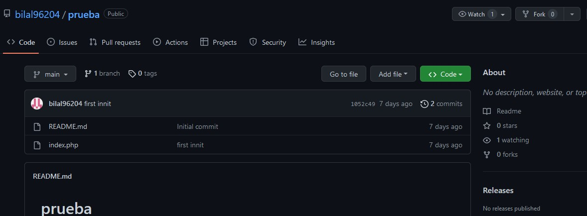
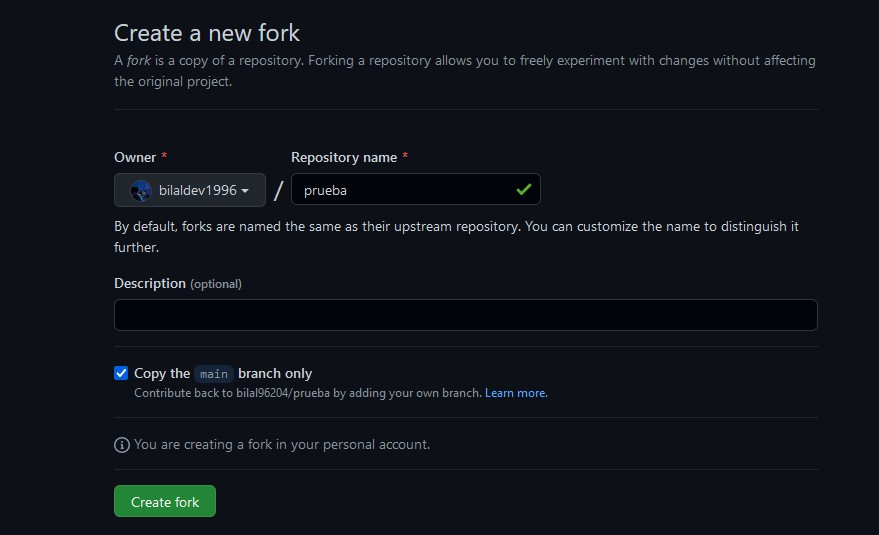
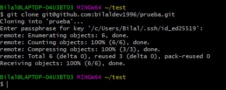
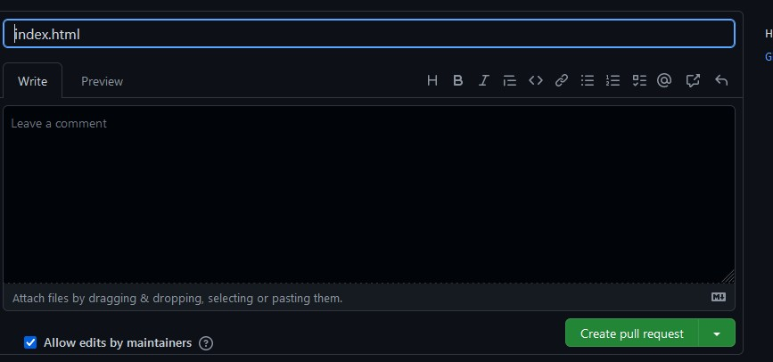
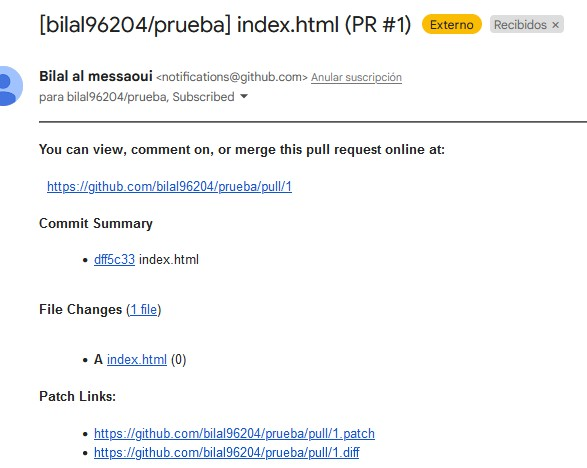

## Fork && Pull Request en github

El "fork" es una de las operativas comunes con el trabajo en Git y GitHub. Básicamente sirve para crear una copia de un repositorio en tu cuenta de usuario  
Buscamos en github el repositorio que queramos bifurcar y le damos a fork 
 
Nos lleva a una página para crear el fork
 
Ya tendríamos el repositorio bifurcado en nuestra cuenta de github en remoto pero no en local, para ello tenemos que clonarlo 
 
Añadimos un fichero de prueba y hacemos un git add . , git commit -m "mensaje" y git push origin main
 
En github buscamos el boton contribute -> open pull request
Nos redirige a una pestaña donde podemos poner un título y comentario al commit. Una vez hecho le damos a Create pull request.
 
Al propietario del repo le llegará una notificación de que se ha hecho un pull request y podrá aceptarlo o rechazarlo.
 

- [Volver al inicio](../index.md)
